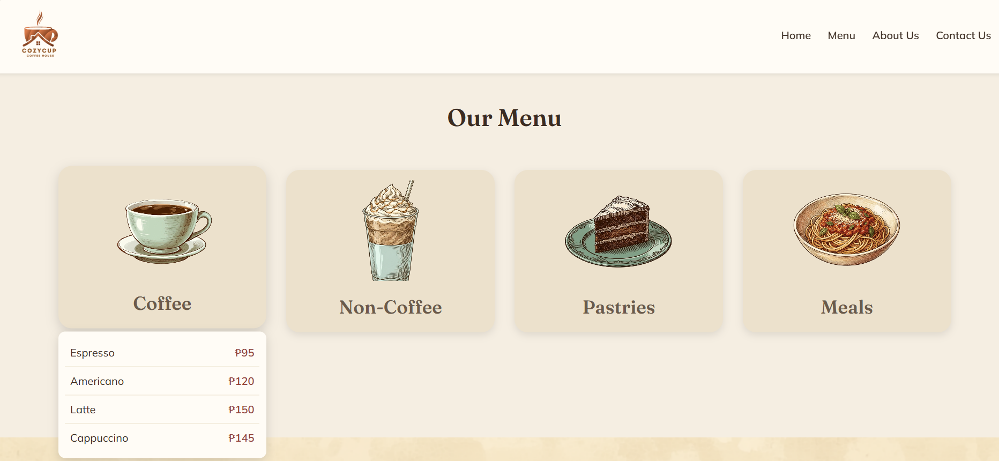

# Cozy Cafe
## Project Description
Cozy Cup Cafe is a web-based application that aims to showcase a modern coffee shop experience. it allows the user to view menus. place order and learn more information about the Cafe in the palme of thier hands and in the comfort of thier homes

## Features
- Interactive homepage with cafe branding
- Menu browsing with categories
- Online ordering system
- Contact and location information

# Screen Captures

This is our menu section, where we showcase different foods.

This is where you will find more information about us

In this section you will find our contacts

# About the Authors

# Author 1

Name: Arjan Dave A. Abirin
Email: senarj113@gmail.com
GitHub: [arj-i2](https://github.com/arj-i2)

# Author 2

Name: Andrea Nicole Balot
Email: email@email.com
GitHub: [Dreax-xDrea](https://github.com/Dreax-xDrea)
